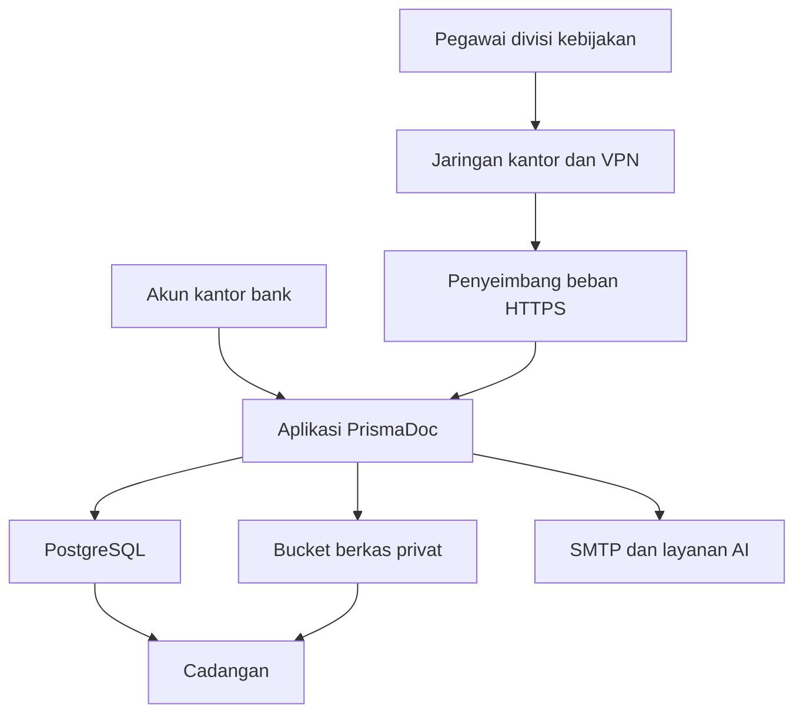
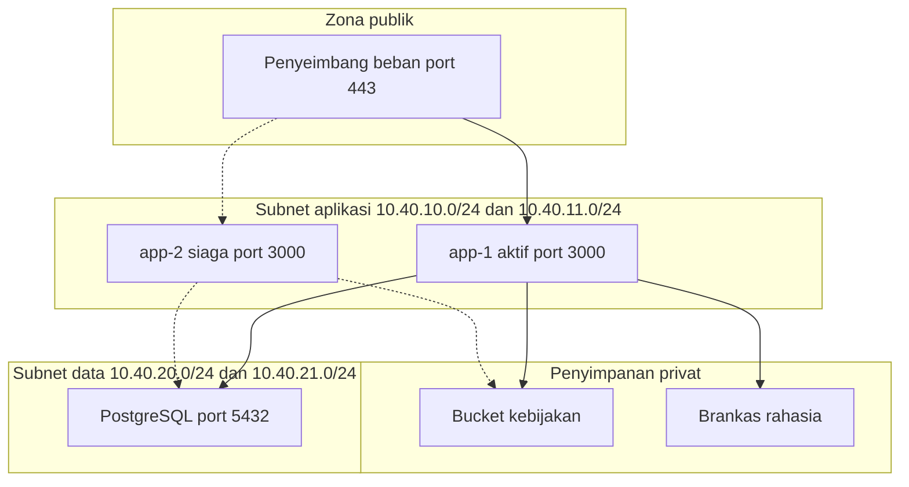

# Topologi infrastruktur PrismaDoc

Dokumen ini untuk penempatan PrismaDoc di divisi kebijakan Eximbank. Wilayah cloud adalah Jakarta, di dalam tenant bank yang sudah ada. Angka ukuran memakai asumsi 150–400 pengguna dan 2.000–10.000 berkas beserta versinya.

Aplikasi hari ini menyimpan berkas di disk lokal (`uploads/`) dan menyalakan pengingat tinjauan di setiap proses. Topologi target memisahkan berkas ke bucket privat dan hanya mengizinkan satu penjadwal.

## HLD

Empat lapisan: akses pegawai, aplikasi, basis data, dan berkas. Basis data dan berkas tidak punya alamat publik.

| Lapisan | Fungsi | Yang tidak boleh |
| --- | --- | --- |
| Akses | Pegawai masuk lewat jaringan kantor atau VPN, lalu akun kantor. | Basis data dan bucket terbuka ke internet. |
| Aplikasi | Melayani halaman, menyimpan metadata, membuat tautan berkas yang berlaku 5 menit, dan mencatat audit. | Menyimpan berkas kebijakan di disk sistem operasi. |
| Basis data | Pengguna, dokumen, versi, alur persetujuan, dan audit. | Menerima koneksi selain dari aplikasi. |
| Berkas | PDF, DOC, DOCX, PNG, dan JPG, maksimal 10 MB per berkas. | Diunduh tanpa lewat aplikasi. |

Alur baca dokumen: pegawai meminta halaman, aplikasi memeriksa peran, lalu mengeluarkan tautan bertanda tangan. Tautan itu hanya berlaku sekitar 5 menit dan hanya untuk sesi yang membuka halaman.

Alur unggah: berkas masuk ke aplikasi, teksnya diambil untuk pencarian, berkas disimpan di bucket, dan nama tersimpannya dicatat di basis data.

Pengingat tinjauan berjalan sekali setiap hari pada pukul 08:00 WIB. Satu penjadwal memanggil aplikasi. Dua penjadwal akan mengirim pengingat dua kali.

## LLD

Ukuran ini untuk produksi divisi, dua zona ketersediaan di Jakarta. Nama zona di bawah memakai AWS sebagai contoh. Di Azure atau Google, subnet, port, dan ukuran mesinnya sama.

`app-2` siaga: mesinnya ada, tetapi proses aplikasi tidak berjalan bersamaan dengan `app-1`. Kode saat ini menyalakan pengingat di setiap proses yang hidup. Dua proses aktif baru aman setelah pengingat dipindah ke satu penjadwal luar.

### Jaringan

| Objek | Nilai |
| --- | --- |
| VPC | `10.40.0.0/16` |
| Subnet penyeimbang, zona A dan B | `10.40.0.0/24`, `10.40.1.0/24` |
| Subnet aplikasi, zona A dan B | `10.40.10.0/24`, `10.40.11.0/24` |
| Subnet data, zona A dan B | `10.40.20.0/24`, `10.40.21.0/24` |
| DNS internal | Nama aplikasi mengarah ke penyeimbang beban |

Aturan akses:

| Sumber | Tujuan | Port |
| --- | --- | --- |
| Jaringan kantor dan VPN | Penyeimbang beban | 443 |
| Penyeimbang beban | Aplikasi | 3000 |
| Aplikasi | PostgreSQL | 5432 |
| Aplikasi | Bucket lewat endpoint privat | 443 |
| Aplikasi | Akun kantor, SMTP, dan layanan AI | 443 atau 587 |

PostgreSQL tidak punya rute ke internet. Bucket menolak akses publik. Aplikasi mengambil rahasia dari brankas, bukan dari berkas yang ikut terpasang di image.

### Server aplikasi

| Item | app-1 | app-2 |
| --- | --- | --- |
| Peran | Proses aktif | Siaga, dinyalakan bila app-1 gagal |
| Ukuran | 2 vCPU, 4 GB RAM | 2 vCPU, 4 GB RAM |
| Disk sistem | 30 GB | 30 GB |
| Proses | `next start`, mendengarkan port 3000 | Sama, dalam keadaan mati |
| Pemeriksaan kesehatan | `GET /login` mengembalikan 200 | Sama |
| Zona waktu | `Asia/Jakarta` | `Asia/Jakarta` |

Penyeimbang beban meneruskan HTTPS ke port 3000. Sertifikat dipasang di penyeimbang beban.

Variabel yang wajib ada di produksi:

| Variabel | Nilai produksi |
| --- | --- |
| `NODE_ENV` | `production` |
| `SHOW_DEMO_ACCOUNTS` | `false` |
| `NEXTAUTH_URL` | Alamat HTTPS aplikasi |
| `NEXTAUTH_SECRET` | Dari brankas rahasia |
| `DATABASE_URL` | Host basis data di subnet data, port 5432 |
| `FILE_URL_SECRET` | Dari brankas rahasia |
| `FILE_URL_TTL_SECONDS` | `300` |
| `REVIEW_CRON` | `0 1 * * *` pada app-1 saja |
| `CRON_SECRET` | Dipakai bila penjadwal luar memanggil `GET /api/cron/review-escalation` |
| Akun kantor | `AZURE_AD_*` atau `OIDC_*` sesuai direktori Eximbank |

Akun percobaan dan sandi `Password123!` tidak dipakai. Sandi lokal hanya untuk admin darurat. Peran pengguna tetap disimpan di basis data PrismaDoc.

### Basis data

| Item | Nilai |
| --- | --- |
| Mesin | PostgreSQL 16 |
| Ukuran | 2 vCPU, 4–8 GB RAM |
| Disk | 100 GB, dapat tumbuh sampai 200 GB |
| Penempatan | Dua zona, satu primer dan satu siaga |
| Nama basis data | `prismadoc` |
| Port | 5432, hanya dari subnet aplikasi |
| Enkripsi | Kunci yang dikelola di wilayah Jakarta |
| Cadangan | Pemulihan ke titik waktu, disimpan 14 hari |
| Jendela cadangan | 01:00–02:00 WIB |

Yang disimpan di sini: akun, peran, dokumen, versi, induk-anak, status, persetujuan, pengesahan baca, audit, nama departemen, dan konfigurasi integrasi. Kunci API dan sandi SMTP disimpan terenkripsi di tabel integrasi, dengan kunci turunan dari `NEXTAUTH_SECRET`.

### Penyimpanan berkas

Target produksi:

| Item | Nilai |
| --- | --- |
| Nama bucket | `prismadoc-kebijakan-prod` |
| Wilayah | Jakarta, wilayah yang sama dengan basis data |
| Akses | Privat, hanya peran aplikasi |
| Enkripsi | Kunci wilayah Jakarta |
| Versi objek | Menyala |
| Kapasitas awal | 200 GB |
| Isi | PDF, DOC, DOCX, PNG, JPG |
| Nama objek | UUID yang sama dengan nama yang dicatat di kolom berkas |

Aplikasi tetap yang memeriksa peran sebelum berkas dikirim. Bucket tidak menjadi URL publik.

Kondisi kode sekarang: `lib/upload.ts` menulis ke folder `uploads/` di disk proses aplikasi. Sebelum dua zona dipakai, folder itu harus diganti ke bucket di atas, atau disk data terpisah yang ikut dicadangkan. Disk sistem 30 GB tidak boleh menjadi tempat dokumen.

Cadangan harian menyalin bucket dan membuang salinan basis data ke lokasi cadangan di wilayah yang sama. Uji pulih sekali sebelum serah terima: pulihkan basis data, pastikan satu dokumen lama masih bisa dibuka.

### Ringkasan ukuran

| Lapisan | Jumlah | Ukuran |
| --- | --- | --- |
| Penyeimbang beban | 1 | HTTPS 443 menuju port 3000 |
| Server aplikasi | 2 | 2 vCPU, 4 GB RAM, disk sistem 30 GB |
| Basis data | 1 primer + 1 siaga | 2 vCPU, 4–8 GB RAM, 100 GB |
| Berkas | 1 bucket privat | 200 GB |
| Penjadwal | 1 | 08:00 WIB, hanya di app-1 |
